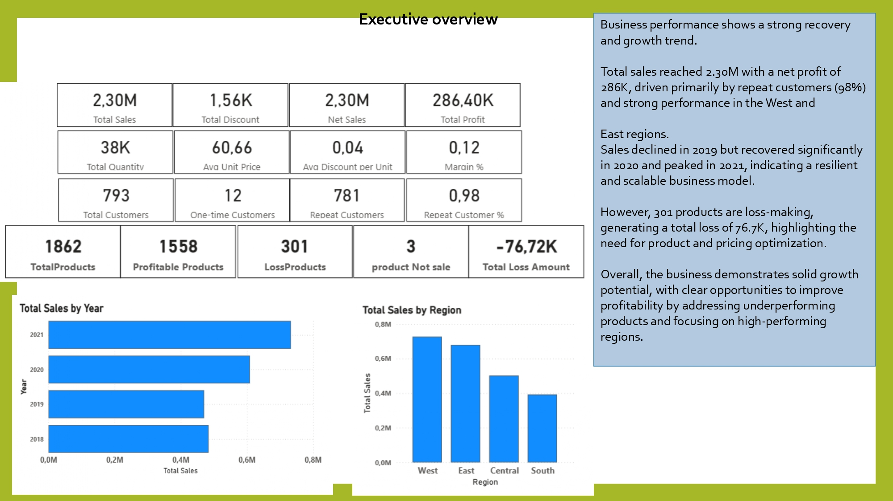

# 📊 Power BI Sales Dashboard (Superstore Analysis)

## 📌 Overview

This project presents an interactive Power BI dashboard built on Superstore sales data.
It provides clear insights into sales performance, profitability, customer behavior, and regional trends to support data-driven decision-making.

## 📊 Dashboard Features

* Sales overview with key KPIs (Revenue, Profit, Orders)
* Regional performance analysis (West, East, Central, South)
* Product and category-level insights
* Time-based trends (Yearly & Monthly analysis)
* Profit vs Sales comparison

## 📈 Key Insights

* Total sales reached approximately **2.3M** with strong overall performance
* Around **98% customers are repeat buyers**, showing high retention
* West and East regions performed best in terms of revenue
* Some products are loss-making, requiring pricing optimization
* Sales dropped in 2019 but showed recovery in later years

## 🛠 Tools & Technologies

* Power BI
* DAX (Data Analysis Expressions)
* Power Query (Data Transformation)
* Data Modeling (Star Schema)
* Microsoft Excel (Data Source)

## 🗂 Dataset Files

* Superstore Sales Dataset (Excel)
* Power BI Report (.pbix)
* PDF Export of Dashboard
* Project Presentation (PPT)

## 💼 Business Value

* Identifies high-performing regions and products
* Highlights loss-making areas for improvement
* Supports strategic decision-making using data insights
* Provides executive-level dashboard for quick analysis

## 🚀 About the Project

This project demonstrates end-to-end data analysis skills:

* Data cleaning and transformation
* Data modeling (fact & dimension tables)
* KPI development
* Dashboard design and storytelling

## 👤 Author

**Hamid Alam**
Data Analyst | Power BI | SQL | Python

📍 Vienna, Austria
📧 Available for job & freelance opportunities
